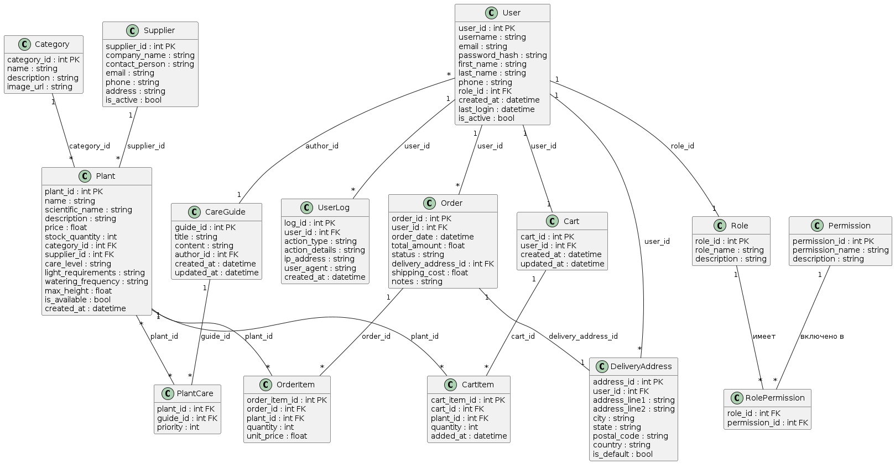

# GreenHouse - Магазин растений
МДиСУБД, 353501, Пранюк Екатерина Дмитриевна

## Описание
Проект представляет собой систему управления магазином растений, включающую функциональность для управления пользователями, заказами, растениями, поставщиками и ролями. Система будет интегрирована с базой данных PostgreSQL.

## Функциональные требования
1. **Авторизация/аутентификация пользователя**:
   Система должна обеспечивать возможность пользователям входить в свою учетную запись и выходить из нее.
   Регистрация нового пользователя с проверкой уникальности email.
   Вход в систему с использованием email и пароля.

2. **Управление пользователями (CRUD)**: 
   Система должна предоставлять функциональность для управления пользователями, включая создание, чтение, обновление и удаление учетных записей.
   Администраторы могут создавать новых пользователей.
   Просмотр списка всех пользователей с возможностью фильтрации.
   Обновление информации о пользователях (например, изменение пароля, имени, роли).
   Удаление учетных записей пользователей.

3. **Система ролей**: 
   Система должна поддерживать различные роли пользователей, такие как администратор, менеджер и клиент.

4. **Журналирование действий пользователя**: 
   Система должна вести журнал действий пользователей для обеспечения безопасности и отслеживания изменений.
   Возможность просмотра журнала действий администратором.
   Фильтрация журнала по дате, пользователю и типу действия.

5. **Система заказов**: 
   Система позволяет совершать заказы на одно или несколько растений.
   Заказы помещаются в корзине и имеют несколько статусов: ожидает оплаты, собирается, доставляется, выполнен.
   Все сделанные заказы отображаются в истории заказов.

6. **Управление каталогом растений**: 
   Система предоставляет возможность управления каталогом растений, включая добавление, редактирование и удаление позиций.
   Фильтрация растений по категориям, цене, сложности ухода.

7. **Система ухода за растениями**: 
   Система содержит руководства по уходу за растениями с рекомендациями по поливу, освещению и другим параметрам.

## Список таблиц для БД:

## Описание таблиц:

1. **User (Пользователь)**
   Назначение: Учетные записи всех пользователей системы.
   Поля:
   - user_id: Уникальный идентификатор пользователя (PK)
   - username: Имя пользователя
   - email: Электронная почта пользователя (уникальна)
   - password_hash: Хэш пароля
   - first_name: Имя
   - last_name: Фамилия
   - phone: Номер телефона
   - role_id: Идентификатор роли (FK)
   - created_at: Дата регистрации
   - last_login: Дата последнего входа
   - is_active: Флаг активности пользователя
   Связь: Имеет много Order, UserLog, DeliveryAddress и одну Cart.

2. **Role (Роль)**
   Назначение: Система ролей пользователей.
   Поля:
   - role_id: Уникальный идентификатор роли (PK)
   - role_name: Название роли
   - description: Описание роли
   - permissions: Права доступа
   Связь: Имеет много User.

3. **UserLog (Журнал действий)**
   Назначение: Логирование действий пользователей.
   Поля:
   - log_id: Уникальный идентификатор записи (PK)
   - user_id: Идентификатор пользователя (FK)
   - action_type: Тип действия
   - action_details: Детали действия
   - ip_address: IP-адрес
   - user_agent: User agent браузера
   - created_at: Время действия
   Связь: Принадлежит одному User.

4. **Plant (Растение)**
   Назначение: Каталог растений магазина.
   Поля:
   - plant_id: Уникальный идентификатор растения (PK)
   - name: Название растения
   - scientific_name: Научное название
   - description: Описание растения
   - price: Цена
   - stock_quantity: Количество в наличии
   - category_id: Идентификатор категории (FK)
   - supplier_id: Идентификатор поставщика (FK)
   - care_level: Уровень сложности ухода
   - light_requirements: Требования к освещению
   - watering_frequency: Частота полива
   - max_height: Максимальная высота
   - is_available: Доступно для продажи
   - created_at: Дата добавления
   Связь: Принадлежит одной Category и одному Supplier, входит в многие OrderItem и CartItem.

5. **Category (Категория)**
   Назначение: Категории растений.
   Поля:
   - category_id: Уникальный идентификатор категории (PK)
   - name: Название категории
   - description: Описание категории
   - image_url: Ссылка на изображение
   Связь: Имеет много Plant.

6. **Supplier (Поставщик)**
   Назначение: Поставщики растений.
   Поля:
   - supplier_id: Уникальный идентификатор поставщика (PK)
   - company_name: Название компании
   - contact_person: Контактное лицо
   - email: Электронная почта
   - phone: Телефон
   - address: Адрес
   - is_active: Активный поставщик
   Связь: Имеет много Plant.

7. **Order (Заказ)**
   Назначение: Заказы клиентов.
   Поля:
   - order_id: Уникальный идентификатор заказа (PK)
   - user_id: Идентификатор пользователя (FK)
   - order_date: Дата заказа
   - total_amount: Общая сумма
   - status: Статус заказа
   - delivery_address_id: Идентификатор адреса доставки (FK)
   - shipping_cost: Стоимость доставки
   - notes: Примечания к заказу
   Связь: Принадлежит одному User, содержит много OrderItem, имеет один DeliveryAddress.

8. **OrderItem (Элемент заказа)**
   Назначение: Состав заказа.
   Поля:
   - order_item_id: Уникальный идентификатор элемента (PK)
   - order_id: Идентификатор заказа (FK)
   - plant_id: Идентификатор растения (FK)
   - quantity: Количество
   - unit_price: Цена за единицу
   - subtotal: Подытог
   Связь: Соединяет Order и Plant.

9. **CareGuide (Руководство по уходу)**
   Назначение: Инструкции по уходу за растениями.
   Поля:
   - guide_id: Уникальный идентификатор руководства (PK)
   - title: Заголовок
   - content: Содержание руководства
   - author_id: Идентификатор автора (FK)
   - created_at: Дата создания
   - updated_at: Дата обновления
   Связь: Принадлежит одному User, имеет много Plant через PlantCare.

10. **PlantCare (Связь растения с руководством)**
    Назначение: Связь многие-ко-многим между растениями и руководствами.
    Поля:
    - plant_id: Идентификатор растения (FK)
    - guide_id: Идентификатор руководства (FK)
    - priority: Приоритет отображения
    Связь: Соединяет Plant и CareGuide.

11. **DeliveryAddress (Адрес доставки)**
    Назначение: Адреса доставки пользователей.
    Поля:
    - address_id: Уникальный идентификатор адреса (PK)
    - user_id: Идентификатор пользователя (FK)
    - address_line1: Адрес строка 1
    - address_line2: Адрес строка 2
    - city: Город
    - state: Область/штат
    - postal_code: Почтовый индекс
    - country: Страна
    - is_default: Адрес по умолчанию
    Связь: Принадлежит одному User, используется в Order.

12. **Cart (Корзина)**
    Назначение: Временное хранение товаров перед оформлением заказа.
    Поля:
    - cart_id: Уникальный идентификатор корзины (PK)
    - user_id: Идентификатор пользователя (FK)
    - created_at: Дата создания
    - updated_at: Дата обновления
    Связь: Принадлежит одному User, содержит много CartItem.

13. **CartItem (Элемент корзины)**
    Назначение: Товары в корзине.
    Поля:
    - cart_item_id: Уникальный идентификатор элемента (PK)
    - cart_id: Идентификатор корзины (FK)
    - plant_id: Идентификатор растения (FK)
    - quantity: Количество
    - added_at: Дата добавления
    Связь: Соединяет Cart и Plant.